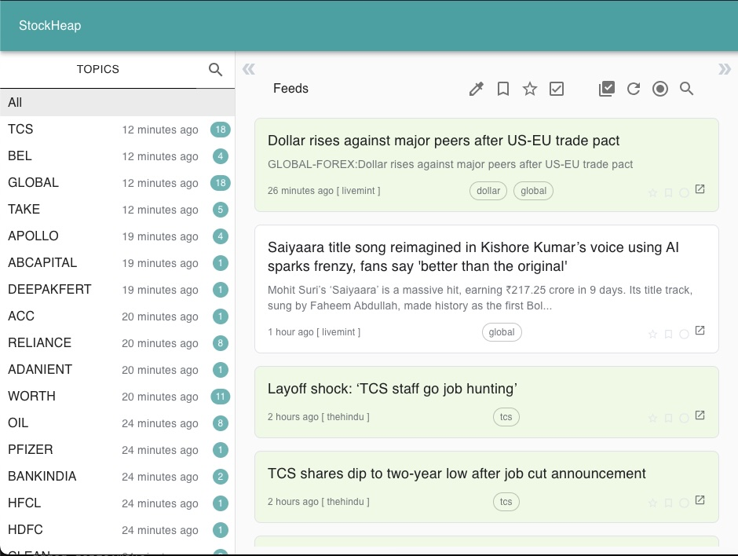

# StockHeap - News Aggregator for Financial Markets



## Overview

StockHeap is a modern, real-time news aggregator application designed specifically for tracking financial markets and company-specific news. Built with React and TypeScript, it provides users with a clean, intuitive interface to monitor news feeds related to various companies, sectors, and financial topics.

## Features

### 🎯 **Real-time News Aggregation**
- Live news feeds from multiple sources
- Real-time updates with WebSocket integration
- Timestamp tracking for all articles

### 📊 **Topic-based Organization**
- Company-specific news tracking (TCS, BEL, RELIANCE, etc.)
- Sector-based categorization (OIL, BANK, GLOBAL)
- Custom topic subscriptions

### 🔍 **Advanced Search & Filtering**
- Search across articles and topics
- Filter by company, sector, or keywords
- Tag-based article organization

### 📱 **Modern UI/UX**
- Clean, responsive three-column layout
- Material-UI components for consistent design
- Intuitive navigation with left sidebar
- Real-time notification badges

### ⭐ **User Experience Features**
- Bookmark important articles
- Mark articles as read/unread
- Star favorite articles
- Read later functionality
- Auto-refresh capabilities

## Technology Stack

- **Frontend**: React 17, TypeScript
- **State Management**: Redux Toolkit
- **UI Framework**: Material-UI
- **Routing**: React Router DOM
- **Real-time**: Socket.io Client
- **HTTP Client**: Axios
- **Build Tool**: Create React App

## Project Structure

```
src/
├── app/                    # Redux store and app configuration
├── components/             # Reusable UI components
├── features/              # Feature-based modules
│   ├── articlelist/       # Article listing functionality
│   ├── auth/             # Authentication components
│   ├── feedlist/         # Feed management
│   ├── layouts/          # Layout components
│   └── tagwatch/         # Tag monitoring
├── hooks/                 # Custom React hooks
├── services/              # API services
├── slices/               # Redux slices
└── utils/                # Utility functions
```

## Getting Started

### Prerequisites

- Node.js (v14 or higher)
- Yarn package manager

### Installation

1. **Clone the repository**
   ```bash
   git clone <repository-url>
   cd stockstack-frontend
   ```

2. **Install dependencies**
   ```bash
   yarn install
   ```

3. **Start the development server**
   ```bash
   yarn start
   ```

   The application will be available at [http://localhost:3002](http://localhost:3002)

### Available Scripts

- `yarn start` - Runs the app in development mode
- `yarn build` - Builds the app for production
- `yarn test` - Launches the test runner
- `yarn eject` - Ejects from Create React App (one-way operation)

## Key Features Explained

### Three-Column Layout
The application uses a sophisticated three-column layout:
- **Left Panel**: Topic navigation with real-time counters
- **Center Panel**: Main content area for articles/feeds
- **Right Panel**: Additional tools and filters

### Real-time Updates
- WebSocket integration for live news updates
- Automatic refresh of article counts
- Real-time notification badges

### Authentication
- Protected routes for authenticated users
- Login/signup functionality
- User-specific feed management

## Configuration

The application supports multiple environment configurations:
- `src/config/local.ts` - Local development settings
- `src/config/production.ts` - Production settings

## Deployment

### Docker Deployment
The project includes Docker configuration for easy deployment:

```bash
# Build the Docker image
docker build -t stockheap-frontend .

# Run the container
docker run -p 3002:3002 stockheap-frontend
```

### Docker Compose
For complete stack deployment:

```bash
docker-compose up -d
```

## Contributing

1. Fork the repository
2. Create a feature branch (`git checkout -b feature/amazing-feature`)
3. Commit your changes (`git commit -m 'Add some amazing feature'`)
4. Push to the branch (`git push origin feature/amazing-feature`)
5. Open a Pull Request

## License

This project is licensed under the MIT License - see the LICENSE file for details.

## Support

For support and questions, please open an issue in the repository or contact the development team.

---

**StockHeap** - Your gateway to real-time financial news and market insights. 